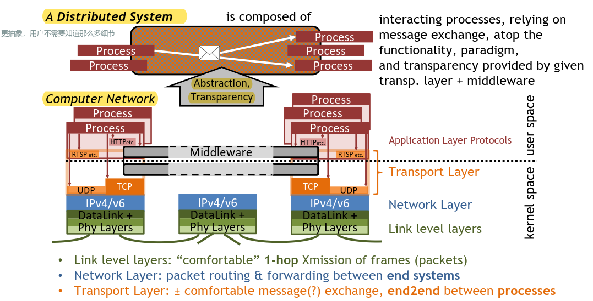
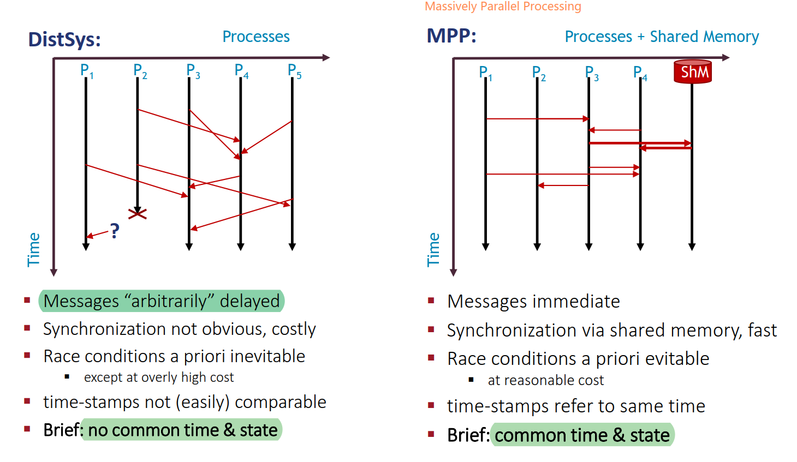
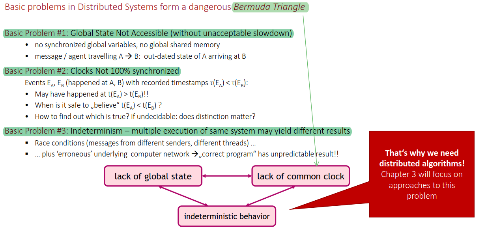
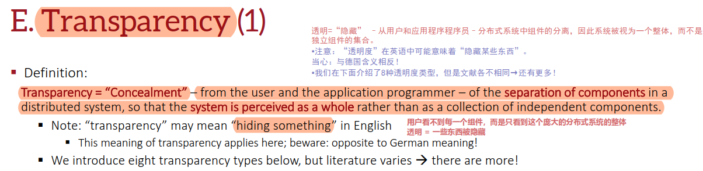
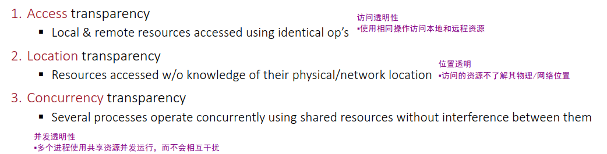
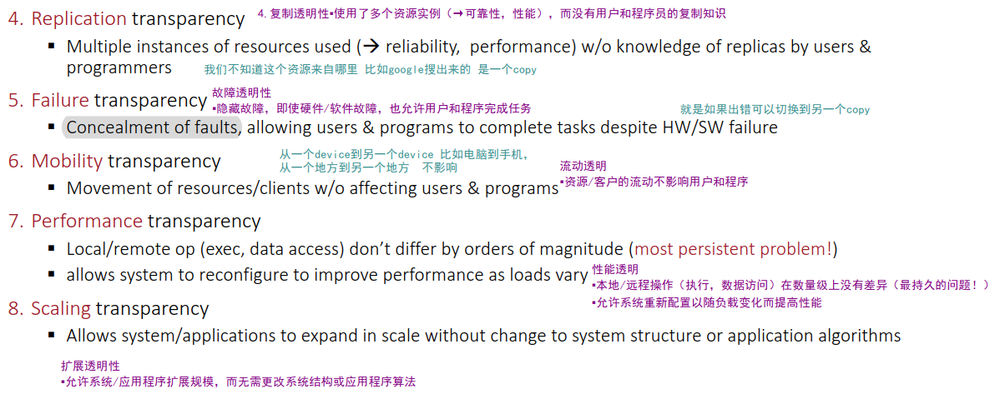
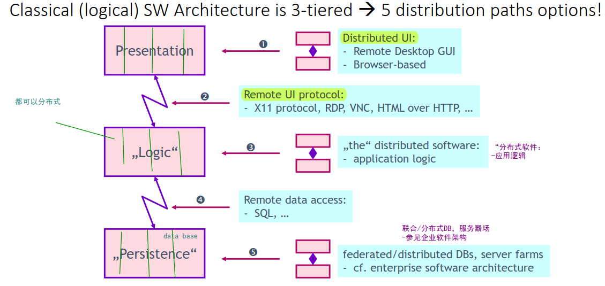
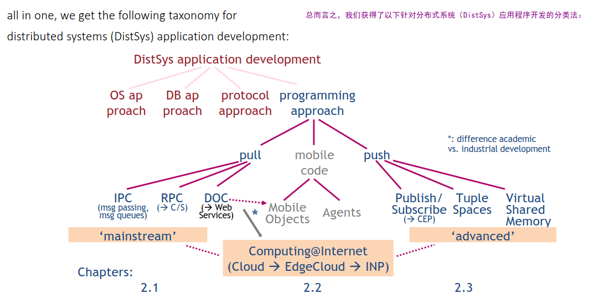

# 一、Distributed System

+ Distributed Systems require Computer Networks 分布式系统需要配合计算机网络才能运作

### 1. Definitions

> In a **Distributed System (‘DistSys’)**, networked computers
> – communicate and coordinate their actions only by passing messages
> – may be spatially separated by any distance

##### 1. Computer Network vs. Distributed System

> **区别：Distributed Systems establish**—atop Computer Networks—**some level of transparency:** locations, distribution, concurrency, performance … 
>
> 

1. 区别是：==**透明性**==

2. 在一个分布式系统中，一组独立的计算机展现给用户的是一个统一的整体，就好象是一个系统似的。系统拥有多种通用的物理和逻辑资源，可以动态的分配任务，分散的物理和逻辑资源通过计算机网络实现信息交换。

3. 分布式系统和计算机网络系统的共同点是：

    多数分布式系统是建立在计算机网络之上的，所以分布式系统与计算机网络在物理结构上是基本相同的。

4. 它们的区别在于：

    + 分布式操作系统的设计思想和网络操作系统是不同的，这决定了他们在结构、工作方式和功能上也不同。
    + 网络操作系统要求网络用户在使用网络资源时首先必须了解网络资源，网络用户必须知道网络中各个计算机的功能与配置、软件资源、网络文件结构等情况，在网络中，如果用户要读一个共享文件，必须知道这个文件放在哪一台计算机的哪一个目录下。
    + 分布式操作系统是以全局方式管理系统资源的，它可以为用户任意调度网络资源，并且调度过程是“透明”的。
    + 当用户提交一个作业时，分布式操作系统能够根据需要在系统中选择最合适的处理器，将用户的作业提交到该处理程序，在处理器完成作业后，将结果传给用户。在这个过程中，用户并不会意识到有多个处理器的存在，这个系统就像是一个处理器一样。

5. 用户透明性观点

    存在一个能为用户自动管理资源的网络操作系统，由它调用完成用户任务所需要的资源，而整个网络像一个大的计算机系统一样对用户是透明的。

分布式系统（distributed system）是建立在网络之上的软件系统。正是因为软件的特性，所以分布式系统具有高度的内聚性和透明性。

因此，网络和分布式系统之间的区别更多的在于高层软件（特别是[操作系统](http://baike.baidu.com/view/880.htm)），而不是硬件。

内聚性是指每一个数据库分布节点高度自治，有本地的数据库管理系统。

透明性是指每一个数据库分布节点对用户的应用来说都是透明的，看不出是本地还是远程。

在[分布式数据库系统](http://baike.baidu.com/view/297197.htm)中，用户感觉不到数据是分布的，即用户不须知道关系是否分割、有无[副本](http://baike.baidu.com/subview/85010/5117526.htm)、数据存于哪个站点以及[事务](http://baike.baidu.com/view/121511.htm)在哪个站点上执行等。

+ **分布式系统的5个特征：**

    1）系统拥有多种通用的物理和逻辑资源，可以动态的给它们分配任务。

    2）系统中分散的物理和逻辑资源通过计算机网络实现信息交换。

    3）系统中存在一个以全局方式管理系统资源的分布式操作系统。

    4）系统中联网各计算机既合作又自治。

    5）系统内部结构对用户是完全透明的。

可以看出：**计算机网络是一种松耦合系统，而分布式系统是一种紧耦合系统。**

**主要区别不在于他们的物理结构，而是高层软件。**

**计算机网络为分布式系统提供了物理平台，而分布式系统是计算机网络技术发展更高级的形式。**

##### 2. DistSys vs. MPP

> 

### 2. Basic Challenge of DistSys

> 

### 3. Requirements – selected

+ 设计分布式系统的时候，要根据情况选择性的实现一些需求：

    > 1. Heterogeneity Support
    > 2. Openness
    > 3. .....

### 4. Abstractions

***How to Simplify and Abstract in Distributed Systems***

**在设计分布式系统时，可以抽象成一些模型去设计。**

> 在TK1我好像就看到了

### 5. Transparency 

==DS的特点：**Distributed Systems establish**—atop Computer Networks—**some level of transparency**==

##### 定义

> **一些东西被隐藏了，用户看不到**
>
> 

##### Transparency举例

***指的是用户看不到以下的（...）***

> 
>
> 
>

# 二、How to Classify Distributed Systems?

### 1. Classification

可以根据不同的耦合性分类各种DS

### 2. Tier Architectures

+ 物理上的层级结构 **physical tiers**

    ###### 2-Tier: early Client-Server

    

    ###### 3-Tier

    > 
    >
    > 

    

    ###### n-Tier: 2nd Tier expanded

### 3. SWE Approaches

4 principles for abstractions wrt. Distributed Software Development

有4种大致的实现分布式的思路，tk1只关注4，这个也是最广泛使用的

1. Distributed operating system approach

2. Distributed database approach

3. Protocol approach for dedicated purposes

4. ###### Distributed Programming approach

    + 通过编程来实现分布式系统：编程语言，编程方法........

##### Distributed Programming approach

`一些例子：如何通过编程实现分布式系统`

### 4. System Models

`各种分布式系统组织形式`

Client/Server

Peer-to-Peer

Mobile Computing

Inlet about SDN & NFV

-------

# 三、缩写

### CN =  Computer Network

> 定义：interconnected collection of autonomous computer systems

### MPP = Massively Parallel Processing